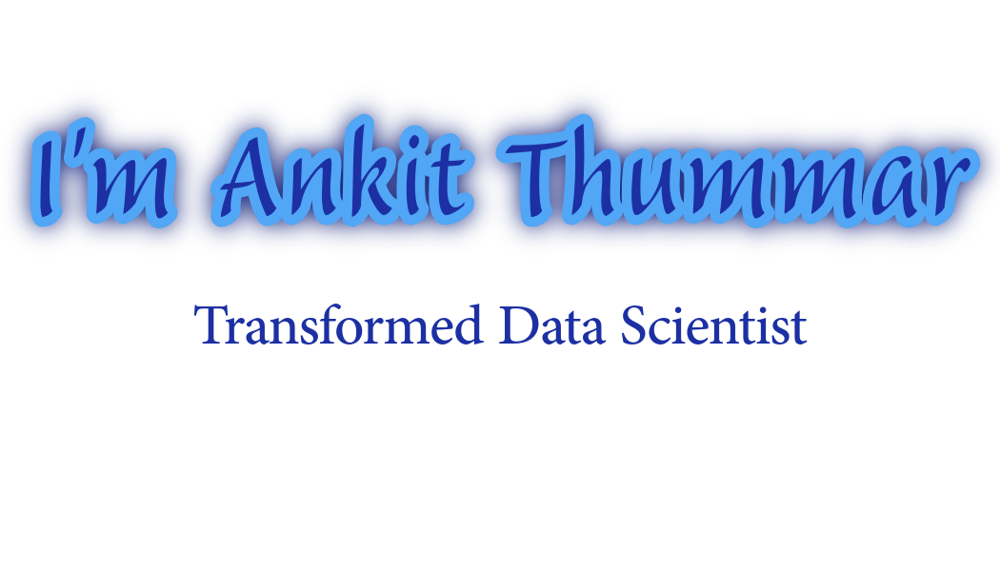

  
  
  
  
  
  
  
  
  
  
  

 
 

  
  
  
  
  
  
  
  
  
  

# About Me

Hi there! 👋 I'm a self-taught Python developer and Machine Learning enthusiast from India. With over 11 years of experience in the chemical manufacturing sector, I have recently transitioned into the exciting field of Data Science and Machine Learning. I'm passionate about leveraging data-driven insights and predictive models to solve real-world problems and drive meaningful impact.

🎯 Collaborating on impactful projects and contributing to open-source initiatives in data science

💡 Along with coding, I create 3D graphics in Blender in my spare time

💬 Ask me about Machine Learning and Statistical Analysis [here](https://github.com/MathRunner7)

 

## 📊 GitHub Stats

|  |  | |
|------|------|------|

## 📊 LeetCode Stats

|  |  |
| -------------------------------------------------------------------------------------------------- | ------------------------------------------------------------------------------------------------------------------------------ |

## Top Repositories

<!---
MathRunner7/MathRunner7 is a ✨ special ✨ repository because its `README.md` (this file) appears on your GitHub profile.
You can click the Preview link to take a look at your changes.
--->
